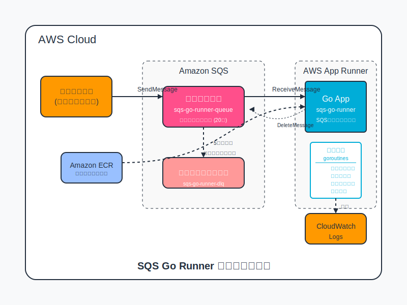

# SQS Go Runner


## 概要

`sqs-go-runner` は AWS SQS (Simple Queue Service) からメッセージを受信して処理するGoアプリケーションです。AWS App Runnerでデプロイされ、メッセージを非同期で確実に処理します。

## アーキテクチャ



### 主要コンポーネント

- **Go Application**: SQSからメッセージを受信・処理するサービス
- **Amazon SQS**: 処理するメッセージを保存するキュー
- **AWS App Runner**: Goアプリケーションを実行する管理サービス
- **Amazon ECR**: Dockerイメージを保存するコンテナレジストリ

### 処理フロー

1. 外部システムがSQSキューにメッセージを送信
2. Go アプリケーションがSQSからメッセージを受信（ロングポーリング方式）
3. 受信したメッセージをgoroutineで並列処理
4. 正常に処理されたメッセージはキューから削除
5. 処理に5回失敗したメッセージはデッドレターキューに移動

## 開発環境のセットアップ

### 前提条件

- Go 1.22以上
- Docker および Docker Compose
- AWS CLI
- Make
- Terraform (本番環境デプロイ用)

### ローカル開発環境の起動

LocalStackを使用して、AWSサービスをローカルでエミュレートします：

```bash
# 開発環境を起動
make dev-up

# テストメッセージの送信
make send-task
make send-notification
make send-data-sync

# ログを確認
make logs

# 開発環境を停止
make dev-down
```

## プロジェクト構造

```
sqs-go-runner/
├── Dockerfile                 # アプリケーションのコンテナイメージ定義
├── Makefile                   # 開発用コマンド
├── README.md                  # プロジェクト説明（本ファイル）
├── docker-compose.yml         # ローカル開発環境の定義
├── go.mod                     # Goの依存関係管理
├── go.sum                     # Goのパッケージバージョン管理
├── init-scripts/              # LocalStack初期化スクリプト
│   └── 01-create-sqs.sh       # SQSキューの作成
├── internal/                  # 内部パッケージ
│   ├── config/                # 設定管理
│   ├── consumer/              # SQSコンシューマーロジック
│   └── handler/               # メッセージ処理ロジック
├── main.go                    # アプリケーションのエントリーポイント
├── scripts/                   # ユーティリティスクリプト
│   └── send-message.sh        # テストメッセージ送信
└── terraform/                 # インフラ定義
    ├── main.tf                # Terraformのメイン設定
    ├── scripts/               # Terraformヘルパースクリプト
    └── terraform.tfvars.example  # 環境変数サンプル
```

## デプロイ方法

### 開発環境でのテスト

```bash
# 開発環境を起動
make dev-up

# テストメッセージを送信してアプリケーションをテスト
make send-task
```

### 本番環境へのデプロイ

Terraformを使用してAWSにデプロイします：

```bash
# Terraform変数ファイルを作成
cd terraform
cp terraform.tfvars.example terraform.tfvars
# 必要に応じて変数を編集

# Terraformを初期化
make tf-init

# デプロイ計画を確認
make tf-plan

# デプロイを実行
make tf-apply
```

## メッセージタイプ

アプリケーションは以下のタイプのメッセージを処理できます：

1. **task** - バックグラウンドタスク処理用
   ```json
   {
     "id": "msg-123",
     "type": "task",
     "data": {
       "taskId": "task-456",
       "priority": "high",
       "action": "process"
     },
     "timestamp": "2023-01-01T12:00:00Z"
   }
   ```

2. **notification** - 通知メッセージ
   ```json
   {
     "id": "msg-456",
     "type": "notification",
     "data": {
       "recipientId": "user-789",
       "title": "新着情報",
       "body": "メッセージが届きました"
     },
     "timestamp": "2023-01-01T12:00:00Z"
   }
   ```

3. **data-sync** - データ同期
   ```json
   {
     "id": "msg-789",
     "type": "data-sync",
     "data": {
       "entityType": "product",
       "entityId": "prod-123",
       "operation": "update"
     },
     "timestamp": "2023-01-01T12:00:00Z"
   }
   ```

## デプロイ構成

このアプリケーションは、AWS App Runnerでパブリックモードで実行されます。これは主に次の理由によります：

1. **シンプルな設定**: VPC設定が不要で、すぐにデプロイできます
2. **ヘルスチェックアクセス**: App Runner内蔵のヘルスチェックが正常に機能します
3. **監視とデバッグ**: パブリックエンドポイントにより、サービスの状態確認が容易になります

## 認証情報の設定に関する注意点

### 開発環境での認証情報

本プロジェクトでは、AWS App Runner上でSQSにアクセスするために環境変数による認証情報の設定を採用しています。

```hcl
# terraform/main.tf 内の設定例
runtime_environment_variables = {
  # 他の環境変数...
  AWS_ACCESS_KEY_ID     = var.aws_access_key_id
  AWS_SECRET_ACCESS_KEY = var.aws_secret_access_key
  AWS_DEFAULT_REGION    = var.region
}
```

### ⚠️ 重要な注意事項

1. **開発用途限定**: この方法は開発やテスト環境での使用を想定しています。本番環境ではIAMロールベースの認証を推奨します。

2. **認証情報の管理**: 
   - 認証情報を含むterraform.tfvars等のファイルはバージョン管理システム（Git等）にコミットしないでください
   - .gitignoreに適切に追加されていることを確認してください

3. **最小権限の原則**: 
   - 使用するIAMユーザーには必要最小限の権限のみを付与してください
   - できるだけ特定のSQSキューに制限したポリシーを使用してください

4. **期限と更新**: 
   - 開発用のアクセスキーには有効期限を設定し、定期的にローテーションしてください
   - 不要になったらIAMユーザーコンソールから速やかに無効化/削除してください

### 代替手段

将来的には以下の方法への移行を検討してください：

1. **IAMロールの使用**: App Runnerのインスタンスロール（`instance_role_arn`）を適切に設定し、環境変数での認証情報設定を避ける

2. **AWS Secrets Manager**: 認証情報をSecrets Managerで管理し、アプリケーション起動時に取得する

3. **一時的な認証情報**: STSサービスを使用して、短期間のみ有効な一時的認証情報を取得する

本プロジェクトの開発環境では、シンプルさと迅速な開発を優先するため環境変数での認証情報設定を採用していますが、セキュリティリスクを認識した上で適切に管理してください。

### セキュリティに関する注意点

App Runnerサービスはパブリックにアクセス可能ですが、このアプリケーションは主にSQSキューからメッセージを受信する役割に特化しているため、セキュリティリスクは限定的です：

- アプリケーションは基本的に入力処理のみを行い、外部からのリクエストに対して最小限の応答（ヘルスチェック）のみを返します
- 外部からのHTTPリクエストはヘルスチェックエンドポイント (`/`) のみが対応します
- サービスを実装する際には、追加のエンドポイントを作成しないよう注意が必要です

より厳格なセキュリティが必要な場合は、VPC設定を追加してプライベート構成に変更することも可能です。その場合、次の点に注意してください：

```bash
# プライベート構成に変更する場合のTerraform変更点
# 1. main.tfにVPC関連の変数を追加（vpc_id, private_subnet_ids）
# 2. App Runner設定にネットワーク構成を追加
# 3. VPCコネクタとセキュリティグループを作成
```

### SQSメッセージの送信方法

SQSキューには、以下の方法でメッセージを送信できます：

1. **AWS SDKを使用**: アプリケーションからAWS SDKを使用してSQSにメッセージを送信
2. **AWSコンソール**: AWS管理コンソールからテストメッセージを送信
3. **AWS CLI**: AWS CLIを使用してコマンドラインからメッセージを送信

```bash
# AWS CLIでメッセージを送信する例
aws sqs send-message \
  --queue-url https://sqs.ap-northeast-1.amazonaws.com/123456789012/sqs-go-runner-queue \
  --message-body '{"id":"msg-123","type":"task","data":{"taskId":"task-456"},"timestamp":"2023-01-01T12:00:00Z"}'
```

